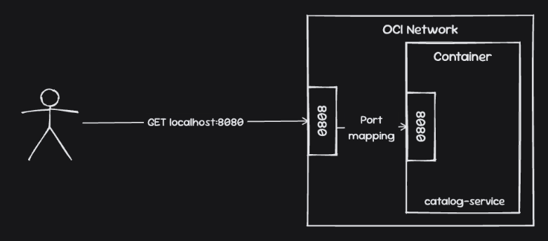
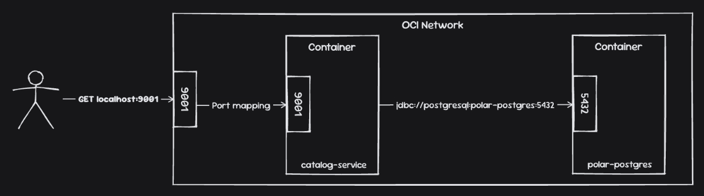
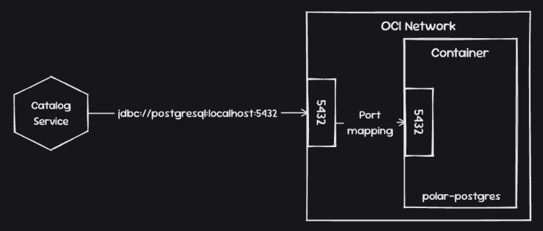

# Chapter 6 – Containerizing Spring Boot

This chapter packages the Catalog Service and Config Service as container images and runs them with PostgreSQL using Docker Compose.

You start by:

- Building a small Java runtime image and learning how containers, images, and registries relate
- Packaging Spring Boot applications with Dockerfiles, including layers, multi-stage builds, and a non-root runtime user

Then you:

- Build application images with **Cloud Native Buildpacks** and scan them with **Grype**
- Connect the applications and PostgreSQL through **Docker networking** and **Docker Compose**
- Build, test, scan, and publish images to **GitHub Container Registry (GHCR)** through GitHub Actions

This builds on Chapter 4's externalized configuration and Chapter 5's JDBC persistence, Testcontainers tests, and Flyway migrations.

> [!NOTE]
> The automated pipeline currently covers the **commit stage**: build, test, scan, package, and publish. Running the published images together and checking their behavior is a separate local exercise. There is no automated deployment or Compose acceptance-test stage in the current workflows.

## 1. Prerequisites

- **JDK 26**, matching both applications' Gradle toolchains
- **Docker** running locally, with **Docker Compose v2**
- **HTTPie**, for the HTTP examples
- **Grype**, for the optional local vulnerability scan
- Internet access for dependencies, container images, and the Config Server's Git backend
- The included **Gradle Wrappers**; a separate Gradle installation is unnecessary

All commands below start from **`Chapter06/`**. Subshells such as `(cd catalog-service && ...)` keep your terminal in that directory afterward.

Stop containers from previous chapters if they already use the names `catalog-service`, `config-service`, or `polar-postgres`, or ports `9001`, `8888`, or `5432`.

## 2. Project Structure and GitHub Mirrors

| Local directory                       | Role                                                                          | Organization repository                                                       |
|---------------------------------------|-------------------------------------------------------------------------------|-------------------------------------------------------------------------------|
| [java-image/](java-image)             | Minimal Dockerfile that prints the Java runtime version                       | Local exercise only                                                           |
| [catalog-service/](catalog-service)   | Catalog API, PostgreSQL persistence, tests, Dockerfiles, and image publishing | [catalog-service](https://github.com/fResult-PolarBookshop/catalog-service)   |
| [config-service/](config-service)     | Git-backed Spring Cloud Config Server, Dockerfile, and image publishing       | [config-service](https://github.com/fResult-PolarBookshop/config-service)     |
| [config-repo/](config-repo)           | Shared configuration YAML files; no application or Gradle build               | [config-repo](https://github.com/fResult-PolarBookshop/config-repo)           |
| [polar-deployment/](polar-deployment) | Docker Compose configuration for the three services                           | [polar-deployment](https://github.com/fResult-PolarBookshop/polar-deployment) |

The organization's [`.github` repository](https://github.com/fResult-PolarBookshop/.github) provides its profile README and book-cover asset.

The organization repositories let each application's `.github/workflows/commit-stage.yml` run at repository root on push. In this learning monorepo, those nested workflows do not run independently; the [root workflow](../.github/workflows/commit-stage.yml) builds and tests the Chapter 6 applications through its project matrix, without publishing their images.

The mirrors have different Gradle project names: locally, `ch06-catalog-service` and `ch06-config-service`; in the organization, `catalog-service` and `config-service`. Local executable JAR filenames therefore have the `ch06-` prefix. The commands below account for this difference.

> [!NOTE]
> The current [Config Server configuration](config-service/src/main/resources/application.yml) still reads **[fResult/cloud-native-spring-config-repo](https://github.com/fResult/cloud-native-spring-config-repo)**, using the `main` label. Editing the local `config-repo/` directory or its organization mirror does not change the configuration served by this setup. To use the organization mirror, explicitly override `SPRING_CLOUD_CONFIG_SERVER_GIT_URI` on Config Service and publish configuration changes there.

## 3. Chapter Overview

| Topic                                       | Hands-on implementation                                                                                                |
|---------------------------------------------|------------------------------------------------------------------------------------------------------------------------|
| Container images and registries             | [Java runtime image](#4-build-a-java-runtime-image) and [GHCR publishing](#10-publish-images-and-check-github-actions) |
| Containerizing Spring Boot with Dockerfiles | [Single-stage, layered, and non-root Dockerfiles](#6-build-application-images)                                         |
| Cloud Native Buildpacks                     | Both applications' `bootBuildImage` tasks                                                                              |
| Container networking                        | [Manual Docker network](#7-run-catalog-and-postgresql-on-a-docker-network) and the existing network diagrams           |
| Managing containers with Docker Compose     | [Catalog, Config, and PostgreSQL together](#8-run-the-system-with-docker-compose)                                      |
| Extending the deployment pipeline           | GitHub Actions build/test and package/publish jobs, with vulnerability scans                                           |

## 4. Build a Java Runtime Image

```bash
docker build -t java-image:1.0.0 java-image
docker image ls java-image
docker run --rm java-image:1.0.0
```

The [Dockerfile](java-image/Dockerfile) installs Ubuntu's `default-jre` and runs `java --version`. The container exits afterward, and `--rm` removes it. Its Java version depends on the Ubuntu package; this introductory image is separate from the Java 26 runtime used by the applications.

## 5. Run the Automated Tests

With Docker running:

```bash
(cd catalog-service && ./gradlew build)
(cd config-service && ./gradlew build)
```

`build` runs the test suite and creates the application artifacts. To rerun only the Catalog persistence or application integration tests:

```bash
(cd catalog-service && ./gradlew test --tests '*BookRepositoryJdbcTest')
(cd catalog-service && ./gradlew test --tests '*CatalogServiceApplicationTests')
```

| Tests                                    | What they verify                                                                         |
|------------------------------------------|------------------------------------------------------------------------------------------|
| `BookValidationTests`, `BookServiceTest` | Input validation and selected service error paths                                        |
| `BookJsonTest`, `BookControllerTest`     | JSON serialization/deserialization and a controller 404 response                         |
| `BookRepositoryJdbcTest`                 | JDBC repository behavior against Testcontainers-managed PostgreSQL                       |
| `CatalogServiceApplicationTests`         | Create/read/update/delete behavior through the Spring application context and PostgreSQL |
| `ConfigServiceApplicationTests`          | Config Server application-context startup                                                |

The Catalog database tests import [TestContainersConfiguration](catalog-service/src/test/java/com/polarbookshop/catalogservice/config/TestContainersConfiguration.java), which supplies PostgreSQL through `@ServiceConnection`. They do not require a manually started `polar-postgres` container. Config Service uses `clone-on-start`, so its context test also depends on access to the configured Git repository.

Although `CatalogServiceApplicationTests` declares `RANDOM_PORT`, its client is bound with `MockMvcWebTestClient.bindToApplicationContext(...)`. Requests go through MockMvc; these tests do **not** exercise the application image, published port, or Compose network. The container smoke tests below cover that additional boundary.

## 6. Build Application Images

Choose either Dockerfiles or Buildpacks. Both routes below produce the explicit `:latest` tags expected by the existing Compose file.

### Option A: Dockerfiles

After the builds in Section 5:

```bash
docker build -t catalog-service:latest \
  --build-arg JAR_FILE=build/libs/ch06-catalog-service-0.0.1-SNAPSHOT.jar \
  catalog-service

docker build -t config-service:latest \
  --build-arg JAR_FILE=build/libs/ch06-config-service-0.0.1-SNAPSHOT.jar \
  config-service
```

The explicit `JAR_FILE` selects the executable Spring Boot JAR and avoids matching both the executable and `-plain.jar` artifacts with `build/libs/*.jar`. In an organization checkout, remove the `ch06-` prefix from the filenames.

The Catalog Dockerfiles show the progression:

| File                                           | Approach                                                                            |
|------------------------------------------------|-------------------------------------------------------------------------------------|
| [Dockerfile_v1](catalog-service/Dockerfile_v1) | Copies and runs the executable JAR in one stage                                     |
| [Dockerfile_v2](catalog-service/Dockerfile_v2) | Extracts Spring Boot layers in a builder stage and copies them into a runtime stage |
| [Dockerfile](catalog-service/Dockerfile)       | Adds the non-root `spring` runtime user to the layered build                        |

Use `-f catalog-service/Dockerfile_v1` or `-f catalog-service/Dockerfile_v2` with the Catalog build command to explore the earlier versions. Config Service uses the layered, non-root approach too.

### Option B: Cloud Native Buildpacks

```bash
(cd catalog-service && ./gradlew bootBuildImage --imageName=catalog-service:latest)
(cd config-service && ./gradlew bootBuildImage --imageName=config-service:latest)
```

Buildpacks generate the images without using the Dockerfiles. `bootBuildImage` packages the application but does not replace the `build`/test step above.

Without `--imageName`, the current Gradle configuration produces `catalog-service:0.0.1-SNAPSHOT` and `config-service:0.0.1-SNAPSHOT`, while Compose expects `:latest`. There is no need to delete the previous image before rebuilding the same tag.

The build files currently spell the builder variable `BP_JVM_version`; the documented Buildpacks variable is `BP_JVM_VERSION`. When explicitly selecting Java 26, correct that key in both build files and verify the resulting build logs. See [Paketo JVM version configuration](https://paketo.io/docs/howto/java/#configure-the-jvm-version).

### Inspect and Scan

```bash
docker image ls catalog-service
docker image ls config-service
grype catalog-service:latest --fail-on high
grype config-service:latest --fail-on high
```

Vulnerability counts depend on the image and vulnerability database at scan time. A passing scan means no findings at the configured threshold for that scan, rather than a permanent guarantee about the image.

## 7. Run Catalog and PostgreSQL on a Docker Network

The three diagrams illustrate host access through published ports and direct communication between containers on the same network:







[Editable network diagrams](https://drawdy.io/share/fbd656f6ef33#key=-MluD3unCaqyArO6R_to9fmi1ceFfYf-ou8w87V-imA)

```bash
docker network create catalog-network

docker run -d \
  --name polar-postgres \
  --network catalog-network \
  -e POSTGRES_USER=user \
  -e POSTGRES_PASSWORD=password \
  -e POSTGRES_DB=polardb_catalog \
  -p 5432:5432 \
  postgres:18-alpine
```

Check database readiness before starting Catalog; repeat until PostgreSQL accepts connections:

```bash
docker exec polar-postgres pg_isready -U user -d polardb_catalog
```

```bash
docker run -d \
  --name catalog-service \
  --network catalog-network \
  -p 9001:9001 \
  -e SPRING_DATASOURCE_URL=jdbc:postgresql://polar-postgres:5432/polardb_catalog \
  -e SPRING_CLOUD_CONFIG_ENABLED=false \
  -e SPRING_PROFILES_ACTIVE=testdata \
  catalog-service:latest

docker logs catalog-service
http --check-status :9001/
http --check-status :9001/books
```

Once startup completes, expect the local greeting and the two demo books, `1234567891` and `1234567892`. This exercise explicitly disables Config Client so it tests Catalog-to-PostgreSQL communication independently.

Inside the application container, `localhost` refers to that container. The datasource therefore uses the database's network name, `polar-postgres`. Publishing `5432:5432` permits host access; container-to-container communication uses the Docker network directly.

Before moving to Compose, remove these exercise containers and their database data:

```bash
docker rm -fv catalog-service polar-postgres
docker network rm catalog-network
```

## 8. Run the System with Docker Compose

The [Compose file](polar-deployment/docker/compose.yml) uses local `catalog-service:latest` and `config-service:latest` images; it has no `build:` entries and does not automatically pull the organization's GHCR images. Build both images in Section 6 first, or use the published-image option below.

### Start Backing Services First

```bash
docker compose -f polar-deployment/docker/compose.yml config --quiet
docker compose -f polar-deployment/docker/compose.yml up -d polar-postgres config-service
```

Check readiness; repeat these commands until both succeed:

```bash
docker compose -f polar-deployment/docker/compose.yml exec polar-postgres \
  pg_isready -U user -d polardb_catalog
http --check-status :8888/catalog-service/testdata
```

The Config Server response should include `propertySources` from the configured Git repository and a `polar.greeting` value. Then start Catalog:

```bash
docker compose -f polar-deployment/docker/compose.yml up -d catalog-service
docker compose -f polar-deployment/docker/compose.yml ps
docker compose -f polar-deployment/docker/compose.yml logs --tail=100 catalog-service config-service
```

The current Compose file has no healthchecks, and Catalog only declares `depends_on: polar-postgres`. Container startup does not guarantee application readiness. Because the Config Client import is optional, Catalog can start with its local greeting if Config Server is unavailable. Starting backing services first and checking the greeting below makes that failure visible. If Catalog already started without remote configuration, restart it after Config Server becomes ready, then repeat the checks.

### Use the Published Images Instead

To test the actual GHCR artifacts, pull and tag both images before following the same startup steps:

```bash
docker pull ghcr.io/fresult-polarbookshop/catalog-service:latest
docker pull ghcr.io/fresult-polarbookshop/config-service:latest

docker tag ghcr.io/fresult-polarbookshop/catalog-service:latest catalog-service:latest
docker tag ghcr.io/fresult-polarbookshop/config-service:latest config-service:latest
```

These commands replace the local `:latest` tags used by Compose. If the services are already running, recreate them with the newly selected images. The workflows build on `ubuntu-24.04` without a multi-platform configuration; on an ARM machine, use compatible emulation or build locally if the published image does not support your platform.

`latest` is overwritten on subsequent successful main-branch publishes. Record each pulled image's digest when you need to identify exactly which artifacts were tested:

```bash
docker image inspect ghcr.io/fresult-polarbookshop/catalog-service:latest --format '{{json .RepoDigests}}'
docker image inspect ghcr.io/fresult-polarbookshop/config-service:latest --format '{{json .RepoDigests}}'
```

### Debugging

Buildpack images understand the Compose `BPL_*` variables; the Dockerfile images do not configure those Buildpack features. Catalog exposes debugger port `8001`. Config Service currently maps `9988:9988` but configures `BPL_DEBUG_PORT=9888`; change that mapping to `9988:9888` before attempting to attach its debugger through host port `9988`.

## 9. Test the Containerized System

Run these checks after the Compose services are ready.

### Verify Configuration and Database Connectivity

```bash
http --check-status :8888/catalog-service/testdata
http --check-status :9001/
http --check-status :9001/books
```

Check that:

- Config Server returns remote property sources containing `polar.greeting`.
- Catalog's `/` response matches that remote greeting, rather than `Welcome to the local book catalog!`.
- `/books` returns the two seeded books after a fresh Catalog startup.

The exact remote greeting can change when the backing Git repository changes. Checking `/books` alone verifies a database read, but does not prove that Catalog loaded remote configuration.

### Verify Create, Read, Update, and Delete

Use an ISBN different from the seeded books. Include `version:=0` because the current API binds JSON directly to the `Book` persistence record with a primitive `int version` field; see [Chapter 5's request-body explanation](../Chapter05/README.md#why-post-and-put-include-version).

```bash
# Create: expect HTTP 201 and a generated id/version.
http --check-status POST :9001/books \
  isbn=1234567893 title="Container Adventures" author="Lyra Silverstar" \
  price:=12.90 publisher="Polarsophia" version:=0

# Read: expect HTTP 200 and the book just created.
http --check-status GET :9001/books/1234567893

# Update: expect HTTP 200 with the new title and price.
http --check-status PUT :9001/books/1234567893 \
  isbn=1234567893 title="Container Adventures Revised" author="Lyra Silverstar" \
  price:=19.90 publisher="Polarsophia" version:=0

# Read again: confirm the update was persisted.
http --check-status GET :9001/books/1234567893

# Delete: expect HTTP 204.
http --check-status DELETE :9001/books/1234567893

# Read after deletion: expect HTTP 404. This error response is intentional.
http GET :9001/books/1234567893
```

Inspect the status codes and response fields; `--check-status` detects HTTP errors but does not assert an exact success status or response body. The update should retain `id` and `createdDate`, update the title/price, and increase `version`. The service uses the database-loaded version for an existing book, so this example does not test stale-client conflict detection.

These are useful chapter-level smoke tests: they exercise real HTTP traffic through the published port, application startup, database migrations, reads/writes, and remote configuration. Use them alongside the Gradle tests and image scans to check the assembled system. Automating these checks against the published image digests would be the next step toward an acceptance stage in the pipeline.

### Cleanup

For this disposable exercise, stop the stack and remove its anonymous database volume:

```bash
docker compose -f polar-deployment/docker/compose.yml down --volumes
```

This deletes the exercise database. The Compose file defines no named database volume. In addition, the `testdata` profile deletes all books and inserts the demo books on **every Catalog startup**, so it is unsuitable for checking whether user-created books survive an application restart.

## 10. Publish Images and Check GitHub Actions

### Automated Organization Workflows

Both service workflows trigger on **push**:

1. **Build and Test** runs `./gradlew build`, scans the source workspace with Grype at the `high` cutoff, and uploads the SARIF report.
2. **Package and Publish** runs only for `main`, after a successful build job. It builds the image with Buildpacks, scans the image at the same cutoff, uploads SARIF, logs in with `GITHUB_TOKEN`, and pushes `:latest` to GHCR.

A push to another branch runs the build job but skips publishing. There is no `pull_request` trigger in these workflows.

| Service | Workflow and runs                                                                                                                                                       | Published package                                                                                           |
|---------|-------------------------------------------------------------------------------------------------------------------------------------------------------------------------|-------------------------------------------------------------------------------------------------------------|
| Catalog | [Workflow](catalog-service/.github/workflows/commit-stage.yml) · [Actions](https://github.com/fResult-PolarBookshop/catalog-service/actions/workflows/commit-stage.yml) | [catalog-service](https://github.com/orgs/fResult-PolarBookshop/packages/container/package/catalog-service) |
| Config  | [Workflow](config-service/.github/workflows/commit-stage.yml) · [Actions](https://github.com/fResult-PolarBookshop/config-service/actions/workflows/commit-stage.yml)   | [config-service](https://github.com/orgs/fResult-PolarBookshop/packages/container/package/config-service)   |

As checked on **2026-09-29**, both the build/test and package/publish jobs succeeded in [Catalog run 36455206314](https://github.com/fResult-PolarBookshop/catalog-service/actions/runs/36455206314) and [Config run 36456645875](https://github.com/fResult-PolarBookshop/config-service/actions/runs/36456645875). Both package pages expose a `latest` image. This confirms those recorded pipeline executions; it does not certify future builds or a running deployment.

### Optional Manual Publishing

For a manual exercise, use a GHCR namespace you can publish to. Set `GHCR_USERNAME`, `GHCR_NAMESPACE`, and `GHCR_PAT` in your shell; use a token with package-write permission.

```bash
printf '%s' "$GHCR_PAT" | docker login ghcr.io -u "$GHCR_USERNAME" --password-stdin

docker tag java-image:1.0.0 "ghcr.io/$GHCR_NAMESPACE/java-image:1.0.0"
docker push "ghcr.io/$GHCR_NAMESPACE/java-image:1.0.0"
```

The existing Gradle publishing configuration can also publish an application image. Gradle can read [project properties from environment variables](https://docs.gradle.org/current/userguide/build_environment.html#sec:project_properties), avoiding a token literal in the command:

```bash
export ORG_GRADLE_PROJECT_registryUrl=ghcr.io
export ORG_GRADLE_PROJECT_registryUsername="$GHCR_USERNAME"
export ORG_GRADLE_PROJECT_registryToken="$GHCR_PAT"

(cd catalog-service && ./gradlew bootBuildImage \
  --imageName="ghcr.io/$GHCR_NAMESPACE/catalog-service:0.0.1-SNAPSHOT" \
  --publishImage)

unset ORG_GRADLE_PROJECT_registryToken GHCR_PAT
```

An image reference such as `ghcr.io/<namespace>/catalog-service:0.0.1-SNAPSHOT` is used with Docker or deployment configuration. View its tags and metadata on the corresponding GitHub **Packages** page.
