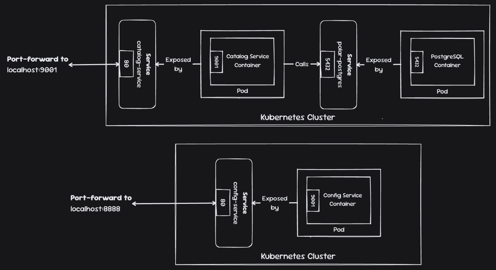
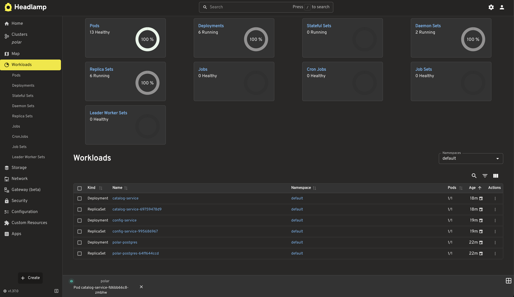
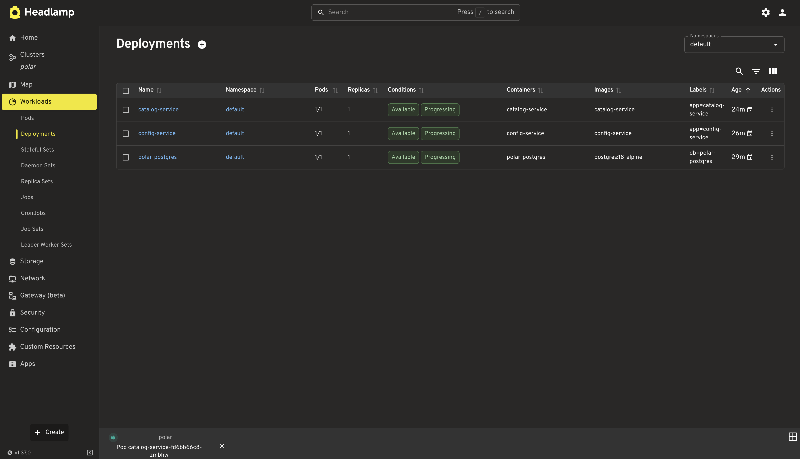
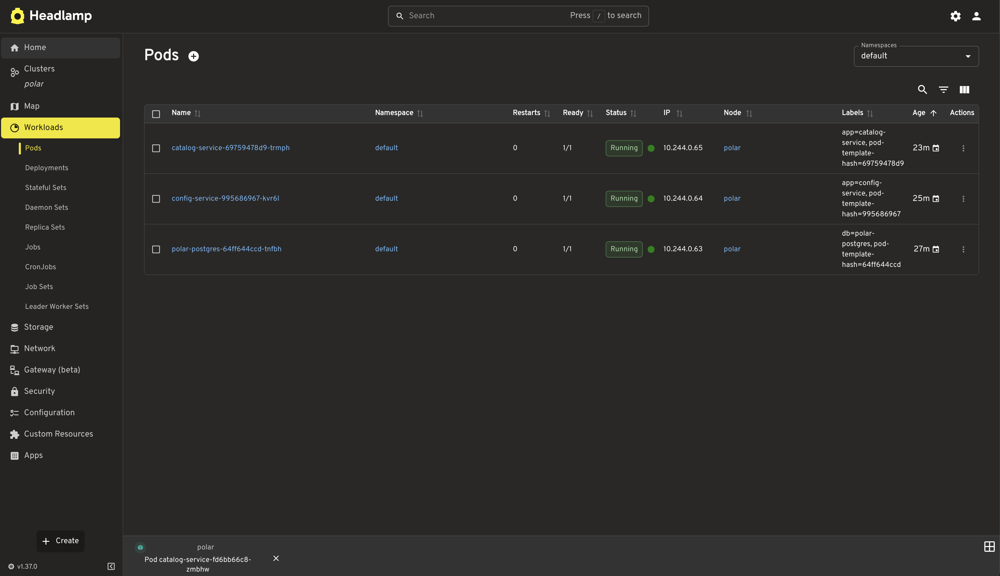
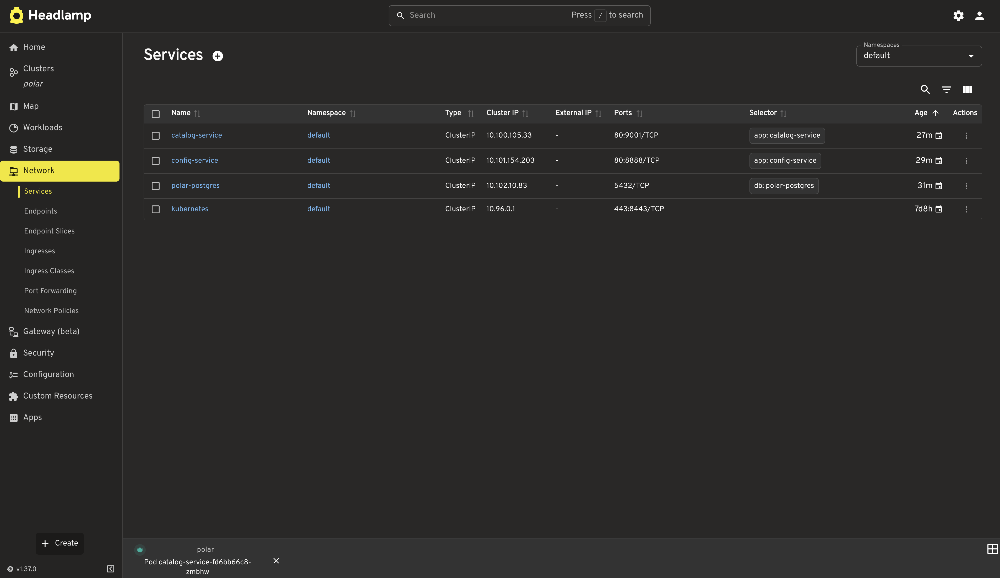
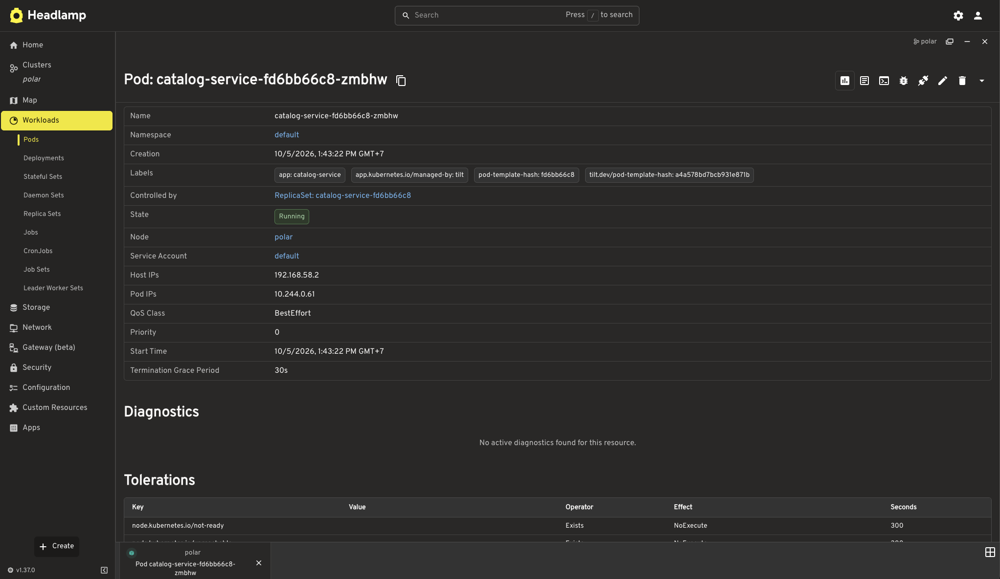
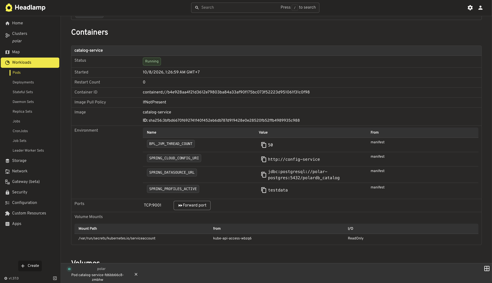

# Chapter 7 – Kubernetes Fundamentals for Spring Boot

This chapter runs the Polar Bookshop development topology on a local Kubernetes cluster: **Config Service**, **Catalog Service**, and **PostgreSQL**.\
It first shows the Kubernetes CLI mechanics, then makes the aggregate Tilt workflow the normal way to develop all services together.

All commands start from **`Chapter07/`**.

Make sure that you are in `Chapter07` directory.

```console
→ pwd
/path/to/cloud-native-spring-in-action/Chapter07
```

## What is in this chapter?

| Directory                             | Purpose                                                                                                      |
|---------------------------------------|--------------------------------------------------------------------------------------------------------------|
| [config-service/](config-service)     | Spring Cloud Config Server on port `8888`                                                                    |
| [catalog-service/](catalog-service)   | Catalog API on port `9001`; obtains external configuration from Config Service                               |
| [config-repo/](config-repo)           | Configuration served by Config Service, local mirror of [fResult-PolarBookshop/config-repo][org-config-repo] |
| [polar-deployment/](polar-deployment) | Docker Compose and Kubernetes manifests, including the aggregate development Tiltfile                        |

Catalog calls `config-service` on Kubernetes Service port 80, which forwards traffic to container port 8888, and calls `polar-postgres:5432`.\
The Config Server reads the remote [fResult-PolarBookshop/config-repo][org-config-repo] Git repository, so provide internet access.

## Prerequisites

- **JDK 26** and the included Gradle wrappers (a separate Gradle installation is unnecessary)
- **Docker Desktop** or **Docker Engine** running locally
- **`kubectl`**, **Minikube**, and **Tilt**
- **HTTPie** or **`curl`** for the API request examples
- *Optional:* **Headlamp Desktop** for visual inspection and **Kubeconform** for manifest validation

On macOS, install the core tools with Homebrew:

```console
brew install kubectl minikube tilt
brew install --cask headlamp # optional
kubectl version --client
minikube version
tilt version
```

On Linux or Windows, install the equivalent tools using the official [kubectl](https://kubernetes.io/docs/tasks/tools/), [Minikube](https://minikube.sigs.k8s.io/docs/start/), and [Tilt](https://docs.tilt.dev/install.html) instructions.\
The Tilt image helper scripts use a POSIX shell, so native Windows needs an equivalent script or WSL.

> [!WARNING]
> Docker Desktop and the `polar` Minikube profile keep separate image stores.\
> The Tilt build helpers load each generated application image into Minikube; the cluster cannot pull a host-only image.

## Start Minikube

Start Docker first, then create, and select the local cluster:

```console
minikube start --cpus 2 --memory 4g --driver docker --profile polar
kubectl config use-context polar
kubectl get nodes
```

Confirm that `kubectl config current-context` prints `polar` before continuing.\
`kubectl` acts as the client; Minikube runs the cluster.

## Learn the Kubernetes CLI path

Tilt automates this path, but doing it once makes the objects and image flow concrete.\
The CLI path deploys all three components because Catalog fails fast when its required Config Service is unavailable.

The following diagram shows why the manual workflow builds an image, tags it, and explicitly loads it into Minikube.\
Docker builds the application image on the host, but Minikube runs Kubernetes with its own image store.\
`minikube image load` bridges those two stores before Kubernetes creates the Pod.


```console
kubectl apply -f polar-deployment/kubernetes/platform/development/services/postgresql.yml

(cd config-service && ./gradlew bootBuildImage)
docker tag config-service:0.0.1-SNAPSHOT config-service:latest
minikube image load config-service:latest --profile polar
kubectl apply -f config-service/k8s
kubectl rollout status deployment/config-service

(cd catalog-service && ./gradlew bootBuildImage)
docker tag catalog-service:0.0.1-SNAPSHOT catalog-service:latest
minikube image load catalog-service:latest --profile polar
kubectl apply -f catalog-service/k8s
kubectl rollout status deployment/catalog-service

kubectl get all -l app=config-service
kubectl get all -l app=catalog-service
kubectl get all -l db=polar-postgres
kubectl port-forward service/catalog-service 9001:80
```

In a second terminal, run `http :9001/books` (or `curl http://localhost:9001/books`).\
The request reaches the Service on port 80, which forwards to the Catalog container on 9001.\
Catalog reaches PostgreSQL through its Service name rather than a Pod IP.

The next diagram shows both logical traffic paths.\
Your local request reaches Catalog through a port-forward and the Kubernetes Service.\
Catalog reaches PostgreSQL through a separate Service inside the cluster.



Use the manual deployment to learn, but use Tilt for the main development loop: the Catalog configuration import fails fast and expects Config Service.\
Clean up any remaining learning objects before moving on:

```console
kubectl delete -f catalog-service/k8s
kubectl delete -f config-service/k8s
kubectl delete -f polar-deployment/kubernetes/platform/development/services/postgresql.yml
```

## Develop the complete environment with Tilt

Deploy PostgreSQL before starting Tilt.\
It is a platform service, so it stays outside Tilt's application development boundary and remains available across `tilt down` / `tilt up` cycles.

```console
kubectl apply -f polar-deployment/kubernetes/platform/development/services/postgresql.yml
kubectl rollout status deployment/polar-postgres
```

Then run this command for local application development:

```console
tilt up -f polar-deployment/kubernetes/applications/development/Tiltfile
```

The aggregate Tiltfile includes both application Tiltfiles.\
It serializes initial application image builds (`max_parallel_updates=1`) to avoid overloading a small Docker/Minikube setup.\
PostgreSQL remains a prerequisite that Kubernetes provides independently of Tilt.

> [!NOTE]
> From this book's architecture, this separation appears intentional rather than accidental.\
> Thomas Vitale keeps Tilt focused on application code that developers rebuild and Live Update.\
> He keeps shared infrastructure in `kubernetes/platform`; later chapters bootstrap PostgreSQL, Redis, and RabbitMQ before starting the application Tilt workflow.\
> This README follows that boundary, so `tilt down` removes applications without managing PostgreSQL.\
> This is an interpretation of the repository structure and workflow, not a direct statement from the author.\
> See the [Chapter 10 development README](https://github.com/ThomasVitale/cloud-native-spring-in-action/blob/main/Chapter10/10-end/polar-deployment/kubernetes/applications/development/README.md) and [platform bootstrap script](https://github.com/ThomasVitale/cloud-native-spring-in-action/blob/main/Chapter10/10-end/polar-deployment/kubernetes/platform/development/create-cluster.sh).

Tilt opens its UI at <http://localhost:10350> and provides these local forwards:

| Resource        | Local URL               | In-cluster Service            |
|-----------------|-------------------------|-------------------------------|
| Config Service  | <http://localhost:8888> | `config-service:80` → `8888`  |
| Catalog Service | <http://localhost:9001> | `catalog-service:80` → `9001` |
| PostgreSQL      | no forward by default   | `polar-postgres:5432`         |

Tilt performs a full build for each Java application during the first update:

1. Build or reuse the tool-enabled Paketo development run image.
2. Run `bootBuildImage` to build the Spring Boot image.
3. Load its uniquely tagged image into Minikube.
4. Apply the manifests and wait for the workloads.

Validate the Tilt configuration without deploying it when needed:

```console
tilt alpha tiltfile-result -f polar-deployment/kubernetes/applications/development/Tiltfile
```

## Verify the deployment

Wait until the workloads report ready, then inspect their Kubernetes state:

```console
kubectl get all -l 'app in (config-service,catalog-service)'
kubectl get all -l db=polar-postgres
kubectl get services
kubectl get endpoints
```

Verify the Config Server serves Catalog's externalized configuration, and then verify that Catalog has received its greeting and can serve books:

```console
http :8888/catalog-service/default
http :9001/
http :9001/books
http :9001/actuator/health
http :8888/actuator/health
```

The first response has property sources containing `polar.greeting`; the root Catalog endpoint returns that greeting, and `/books` returns the book collection.\
Do not rely on exact IDs, timestamps, or Pod suffixes: they change on each run.

## Fast development loop: Live Update

Tilt does not copy Java source directly into the running container.\
Compile it first; Tilt watches the resulting `build/classes/java/main` and `build/resources/main` directories and synchronizes them to `/workspace/BOOT-INF/classes`.\
Spring Boot DevTools and Paketo process reloading then restart the application process inside the existing Pod.

For example, in another terminal, continuously compile Catalog while Tilt is running:

```console
(cd catalog-service && ./gradlew classes --continuous)
```

Alternatively, enable IDE automatic compilation.\
In IntelliJ IDEA, **Build Project** with <kbd>⌘</kbd> + <kbd>Shift</kbd> + <kbd>F9</kbd> quickly produces updated classes.

To demonstrate Live Update:

1. Record the Pod UID: `kubectl get pod -l app=catalog-service -o jsonpath='{.items[0].metadata.uid}'`.
2. Change a Java class or resource, and let Gradle or the IDE compile it.
3. Confirm the corresponding file timestamp changes under `build/classes` or `build/resources`.
4. In Tilt, confirm that it reports a **Live Update** and skips the custom image-build steps.
5. Check the Pod UID again and call the affected endpoint.\
   The UID stays unchanged and the endpoint shows the new behavior.

Keep the compiled directories in `custom_build.deps`, otherwise Tilt has nothing to watch.\
`fall_back_on(image_build_deps)`, rather than removing those directories from `deps`, distinguishes a full build from a Live Update.

### Full rebuild is different

Change an image-build input such as `build.gradle.kts`, `Dockerfile.tilt-run`, or `scripts/build-and-load-tilt-image.sh`.\
Tilt then runs the full custom build, generates and loads a new image tag, and replaces the Pod.

The Tilt UI's **Trigger Update** explicitly requests a resource rebuild, so it runs `STEP 1/3` after you click it.\
Do not use it to test automatic Live Update.\
IDE **Build Project** / Gradle compilation produces watched output; **Trigger Update** requests a rebuild—these operations do different work.

## How the local-only image build works

Each service's `Tiltfile` calls `scripts/build-and-load-tilt-image.sh`.\
The helper selects `linux/arm64` or `linux/amd64`, builds `Dockerfile.tilt-run`, invokes `./gradlew -PtiltDev bootBuildImage`, loads the resulting tag into the `polar` profile, and writes that exact image reference for Tilt.

The Paketo tiny run image omits `tar` and `rm`, which Tilt needs to synchronize and remove files during Live Update.\
`Dockerfile.tilt-run` adds those tools; it becomes the run-image base of the final application image.\
Docker normally caches its stable layers, so this is not a second unrelated application build.

`-PtiltDev` enables only local development settings: a compatible Jammy buildpackless builder, Docker Hub Java buildpack, the custom run image, live reload, and a compatible JVM.\
The helper creates the tag itself because `outputs_image_ref_to` requires it; it must not assume an `EXPECTED_REF` environment variable exists.

GitHub Actions and normal production publishing use ordinary Gradle tasks without `-PtiltDev`.\
Local Tilt choices therefore do not automatically affect published images.

## Troubleshooting

| Symptom                                      | Likely cause                                                   | Check or correction                                                                                       |
|----------------------------------------------|----------------------------------------------------------------|-----------------------------------------------------------------------------------------------------------|
| `ErrImagePull` / `ImagePullBackOff`          | Image exists only in host Docker                               | Confirm the helper completed `minikube image load`; inspect `minikube image ls --profile polar`.          |
| Live Update becomes a full build             | A `fall_back_on` file changed, or you manually triggered Tilt  | Inspect the changed path and Tilt's build reason.                                                         |
| Java edit has no effect                      | Gradle or the IDE did not compile the source                   | Run continuous Gradle compilation or build in the IDE; check the `.class` timestamp.                      |
| Sync source is outside watched paths         | Someone removed compiled output from `custom_build.deps`       | Keep both compiled directories in `deps`; use `fall_back_on` for build inputs.                            |
| Live Update cannot find `tar` or `rm`        | Final image did not use the development run image              | Verify `-PtiltDev`, `runImage`, and `Dockerfile.tilt-run`.                                                |
| `EXPECTED_REF` is unbound                    | Helper assumes a value unavailable with `outputs_image_ref_to` | Generate the tag in the helper and write it to the configured ref file.                                   |
| Catalog times out at `http://config-service` | Service port does not match the URI                            | Config Service must expose `port: 80`, `targetPort: 8888` (or use `:8888` consistently).                  |
| Config request returns HTTP 500              | Config Service cannot load the Git repository/profile          | Inspect Config Service logs and the remote configuration repository; this differs from a network timeout. |
| Build runs after **Trigger Update**          | The button requests a resource rebuild                         | Expected; test Live Update by changing compiled output instead.                                           |

Use this short diagnostic sequence before guessing:

```console
kubectl get pods
kubectl get services
kubectl get endpoints config-service
kubectl describe pod <pod-name>
kubectl logs deployment/config-service
kubectl logs deployment/catalog-service
```

## Inspect with Headlamp

Headlamp Desktop is optional.\
Open it, choose the `polar` kubeconfig context, and inspect the same objects you verified above: Deployments, Pods, Services, endpoints, events, and logs.\
You should see Config Service, Catalog Service, and PostgreSQL.\
During a deliberate full rebuild, watch Kubernetes replace the Catalog Pod; during a Live Update, Kubernetes keeps its Pod in place.

The included images illustrate the relevant views:






Open the Catalog Pod to inspect the Kubernetes details for one running workload.\
The overview shows that a ReplicaSet controls the Pod, that the Pod runs on the `polar` node, and that Tilt manages the application Pod.\
Pod names, Pod IPs, timestamps, ReplicaSet hashes, and Tilt hashes change between deployments, so use this view to understand ownership and state rather than to match exact values.



Scroll to the container configuration to inspect the environment that the Deployment supplies.\
The view confirms the Config Server URI, PostgreSQL datasource URL, active `testdata` profile, and application port `9001`.\
Use it to diagnose incorrect Kubernetes wiring without treating the generated container ID or image digest as stable documentation values.



## Validate manifests and clean up

Validate every manifest used by the aggregate environment:

```console
kubeconform --strict --summary --verbose \
  catalog-service/k8s \
  config-service/k8s \
  polar-deployment/kubernetes/platform/development/services/postgresql.yml
```

Tear down the applications with the aggregate Tiltfile.\
Then delete the platform service separately and stop the cluster:

```console
tilt down -f polar-deployment/kubernetes/applications/development/Tiltfile
kubectl delete -f polar-deployment/kubernetes/platform/development/services/postgresql.yml
minikube stop --profile polar
```

> [!CAUTION]
> The following commands remove **every matching Tilt-tagged service image** from Docker and the `polar` Minikube image store.\
> Inspect the listed images first; do not run them if another project uses matching tags.
>
> ```console
> docker images --format '{{.Repository}}:{{.Tag}}' | grep -E '^(catalog|config)-service:tilt-'
> minikube image ls --profile polar | grep -E '^(catalog|config)-service:tilt-'
>
> docker rmi $(docker images --format '{{.Repository}}:{{.Tag}}' | grep -E '^(catalog|config)-service:tilt-')
> minikube image rm $(minikube image ls --profile polar | grep -E '^(catalog|config)-service:tilt-') --profile polar
> ```
>
> The safer alternative is to delete one reviewed image at a time: `docker rmi <image_name|image_id>` or `minikube image rm <image_name|image_id> --profile polar`.

[org-config-repo]: https://github.com/fResult-PolarBookshop/config-repo
